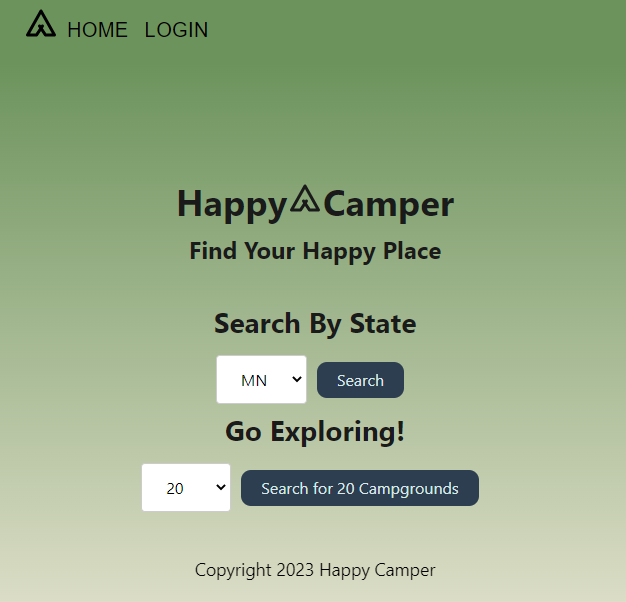
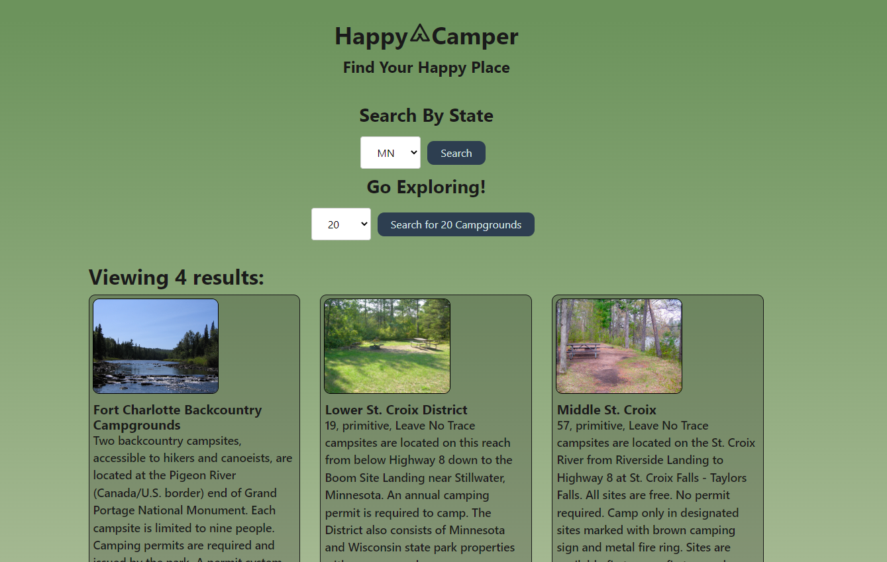
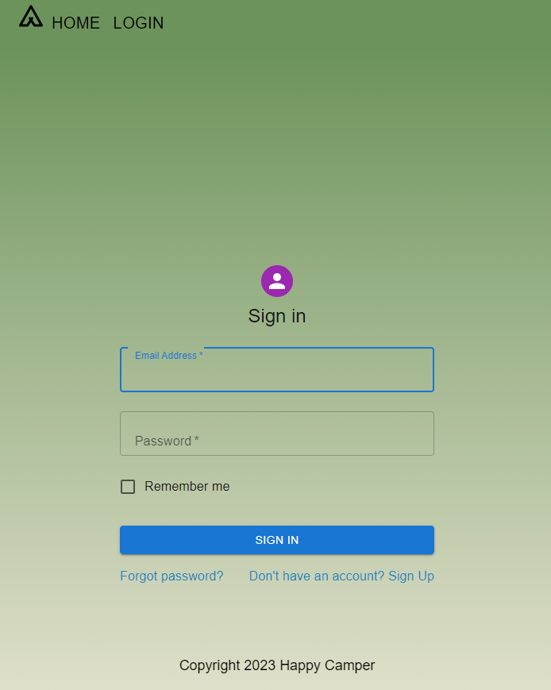
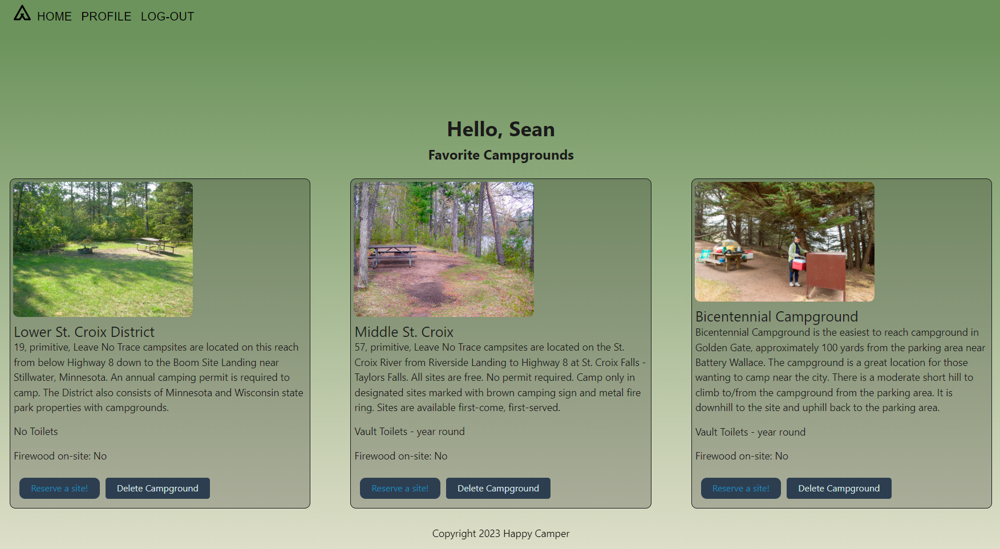

# Happy Campers Camping App

## Description

AS A USER who enjoys camping in our National Parks  
I WANT to have an effective method to search/ view camp grounds by location and amenity  
SO THAT I can plan my future camping excursions.

Being that we love the great out doors and camping we were looking for a way to help us plan future camping trips.  We were able to use the National Parks API to populate National Parks by state.  

Once the user has found parks they would like to visit/ make note of they are able to save them to their favorite Campground list.  This will allow for quick access when trying to figure out where they want to go next.  

This app is going to save time by providing all the information in an easy to navigate and easy to save format.

## Table of Contents (Optional)

- [Installation](#installation)
- [Usage](#usage)
- [Tech Used](#tech-used)
- [Credits](#credits)
- [License](#license)
- [Questions](#questions)

## Installation

With our application there is no installation necessary - one can simply launch the app through the deployed heroku link here:  

https://happy-camper12345.herokuapp.com/

When you click on the link above you will be taken to our home page where you can see a list of National Parks and their descriptions.  

## Usage
Link to deployed application: https://happy-camper12345.herokuapp.com/ 

Once you click on the link above you will be whisked away to our home page.  On the home page you have the ability to browse camp sites by state.  You also have the ability to click on the reservation button and it will take you to the reservation page for that park.  Once there you can book the dates that work for you.

If you are still in a research phase you have the ability to create a user/ login and save your parks to your favorite campground list - You can then look at the various amenities and choose your campgrounds for your ultimate trip.  If you decide that the campground you chose isn't for you, you have the ability to delete the campground from your favorite list and it will no longer be an option.

Have fun exploring and Happy Camping!!!

 
 
 

## Tech-Used
MongoDB 
Express.JS 
React 
Node.JS 
GraphQL 
BCrypt 
Mongoose 
JsonWebToken 
Apollo Client 
Material UI 
React-Bootstrap 

## Credits

Our Amazing TA - Jess Guico - https://github.com/jessicamcg  
Connor Beer - https://github.com/CBshmear  
William Burton - https://github.com/wburnton  
Colin Bradshaw - https://github.com/lilcguy  
Sean McGuire - https://github.com/swmcguire 

## License

MIT License

Copyright (c) 2023 Happy Campers

Permission is hereby granted, free of charge, to any person obtaining a copy
of this software and associated documentation files (the "Software"), to deal
in the Software without restriction, including without limitation the rights
to use, copy, modify, merge, publish, distribute, sublicense, and/or sell
copies of the Software, and to permit persons to whom the Software is
furnished to do so, subject to the following conditions:

The above copyright notice and this permission notice shall be included in all
copies or substantial portions of the Software.

THE SOFTWARE IS PROVIDED "AS IS", WITHOUT WARRANTY OF ANY KIND, EXPRESS OR
IMPLIED, INCLUDING BUT NOT LIMITED TO THE WARRANTIES OF MERCHANTABILITY,
FITNESS FOR A PARTICULAR PURPOSE AND NONINFRINGEMENT. IN NO EVENT SHALL THE
AUTHORS OR COPYRIGHT HOLDERS BE LIABLE FOR ANY CLAIM, DAMAGES OR OTHER
LIABILITY, WHETHER IN AN ACTION OF CONTRACT, TORT OR OTHERWISE, ARISING FROM,
OUT OF OR IN CONNECTION WITH THE SOFTWARE OR THE USE OR OTHER DEALINGS IN THE
SOFTWARE.

---

## Questions
Please contact us with any further questions.  You can reach us by using any of the GitHub links below: 
Connor Beer - https://github.com/CBshmear  
William Burton - https://github.com/wburnton  
Colin Bradshaw - https://github.com/lilcguy  
Sean McGuire - https://github.com/swmcguire
